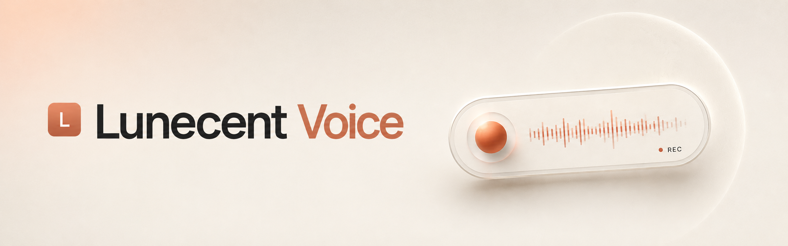

<p align="center">
  
</p>

Hold a hotkey, talk, release. Your speech is transcribed locally and pasted into
whatever window has focus. Runs fully offline. Works on **Windows** and **macOS**
(Apple Silicon).

Transcription is done by whisper.cpp (`large-v3-turbo` by default). There is an
optional local LLM pass (Gemma via llama.cpp) that rewrites the raw transcript, but
it is off by default and you don't need it. The plain Whisper output is already
accurate.

Built with Tauri 2 (Rust) and Svelte 5.

## How it works

```
mic -> cpal capture -> Silero VAD (trim silence) -> whisper.cpp (GPU or CPU)
    -> filler/dictionary cleanup -> optional LLM rewrite -> clipboard + paste
```

- **Windows:** global hotkey via low-level `WH_KEYBOARD_LL` + `WH_MOUSE_LL` hooks,
  so it fires even when the app is not focused. You can bind mouse buttons (middle,
  back, forward) on top of Ctrl/Shift/Alt/Win.
- **macOS:** global hotkey via `CGEventTap` (runs on the main thread, as required
  since macOS 26). Same modifier + key bindings as Windows.
- The mic stream is kept open and pre-warmed, so recording starts instantly.
- Whisper tries the GPU first and falls back to CPU automatically. A CPU tag shows
  on the widget when that happens.
- Text is delivered by writing to the clipboard and sending the paste shortcut
  (`Ctrl+V` on Windows, `Cmd+V` on macOS), then restoring your previous clipboard.
  Elevated windows on Windows block simulated input — in that case the text is left
  on the clipboard for you to paste manually.
- Everything stays on the machine. The network is only touched to download models
  on first run, or if you point the LLM at a remote endpoint.

---

## Requirements

### Windows — GPU build (NVIDIA)

- Windows 10 64-bit (1809+) or Windows 11
- NVIDIA GPU with a current driver. ~4 GB VRAM for `large-v3-turbo`, 6 GB+ for
  `large-v3`, plus ~3 GB more if you enable Gemma cleanup. RTX 50-series (Blackwell)
  needs a driver that ships the CUDA 12.8+ runtime.
- 8 GB system RAM
- ~5 GB free disk (Whisper turbo is 1.6 GB; optional Gemma model is 2.4 GB)
- A microphone

### Windows — CPU build

- Windows 10/11 64-bit, any x64 CPU. No GPU required.
- 8 GB RAM minimum, 16 GB recommended (model sits in RAM).
- Transcription is slower than GPU. `medium` is the practical model choice;
  `large-v3-turbo` works but is heavy on CPU.

### macOS

- Apple Silicon (M1 or later). Metal GPU acceleration is used by default.
- macOS 13 Ventura or newer.
- 8 GB RAM minimum. ~5 GB free disk for models.
- A microphone. macOS will prompt for microphone permission on first launch.

### To build from source (all platforms)

Add: Rust (rustup), Node 18+, CMake.

- **Windows:** Visual Studio 2022 with the "Desktop development with C++" workload,
  LLVM (for libclang). GPU build also needs CUDA Toolkit 12.8+ (13.x for RTX 50-series).
  Budget ~10 GB for toolchains and build output.
- **macOS:** Xcode Command Line Tools (or full Xcode), Homebrew. The setup script
  installs everything else automatically.

---

## Install (end user)

1. Download the latest release from the Releases page.
   - Windows: choose the GPU build (NVIDIA, fast) or the CPU build (runs anywhere,
     slower).
   - macOS: download the `.dmg` (Apple Silicon only).
2. Run the installer / open the `.dmg` and drag the app to Applications.
3. Open Settings → Models and download a Whisper model.
4. Hold the hotkey, talk, release. The text lands wherever your cursor is.
   - Windows default: `Ctrl+Shift+Space`
   - macOS default: `Ctrl+Shift+Space`

Hotkeys, model, language, dictionary and the rest are in Settings.

---

## Build from source — Windows

Install the toolchain once:

```powershell
winget install Rustlang.Rustup Kitware.CMake LLVM.LLVM
winget install Nvidia.CUDA   # GPU build only
```

You also need Visual Studio 2022 with the Desktop C++ workload.

Then from the project root:

```powershell
# GPU build — produces an NSIS .exe and .msi installer
build.bat

# CPU build — runs on any Windows machine, no GPU needed
build-cpu.bat
```

Both scripts wrap the same steps:

```powershell
. .\scripts\build-env.ps1                  # sets CUDA_PATH, LIBCLANG_PATH, PATH
npm install
npm run fetch-deps                          # GPU: llama-server + CUDA DLLs + VAD model
npx tauri build --features cuda             # GPU
npx tauri build --no-default-features --features vad --config src-tauri/tauri.cpu.conf.json  # CPU
```

Installers land in `src-tauri/target/release/bundle/` (NSIS `.exe` and `.msi`).
The standalone executable is `src-tauri/target/release/lunecent-voice.exe`.

## Build from source — macOS

The setup script installs all missing dependencies (Homebrew, Rust, Node, CMake)
automatically. You only need to run it once.

```bash
# Check and install dependencies
./scripts/mac-setup.sh

# Build the .dmg installer (Apple Silicon, Metal GPU)
./scripts/build-dmg.sh
```

The `.dmg` lands in `src-tauri/target/release/bundle/dmg/`.

---

## Run from source (dev mode)

### Windows

```powershell
run-dev.bat
```

Kills any running instance, sets up the build environment, and launches `tauri dev`
(Vite on port 1420 + Rust app with hot reload). First run compiles the Rust side,
which takes a few minutes.

### macOS

```bash
# Metal GPU (default)
./scripts/run-dev.sh

# CPU only
./scripts/run-dev.sh cpu
```

Same behavior: kills any running instance and launches `tauri dev` with hot reload.

---

## Configuration

Settings live in:

- **Windows:** `%APPDATA%\com.lunecent.voice\settings.json`
- **macOS:** `~/Library/Application Support/com.lunecent.voice/settings.json`

Settings are editable from the Settings window. Models and the history database
live in the same folder.

Notable keys: `whisper_model`, `language`, `prefer_gpu`, `hotkey_ptt`,
`hotkey_toggle`, `vad_enabled`, `filler_removal`, `dictionary`, and the `llm_*`
group for the optional cleanup pass.

The LLM cleanup is off unless you enable it in Settings and a llama-server binary
is present (the Windows GPU `fetch-deps` pulls one). You can also point `llm_backend`
at an OpenAI-compatible, Anthropic, or Ollama endpoint instead of the local server.

---

## Source layout

```
src-tauri/src/
  audio.rs          pre-warmed cpal capture, downmix + resample to 16 kHz, mic level
  vad.rs            Silero v5 VAD via onnxruntime, energy-gated fallback
  transcribe.rs     whisper-rs, GPU then CPU
  inputhook.rs      WH_KEYBOARD_LL + WH_MOUSE_LL global hotkey (Windows)
  inputhook_mac.rs  CGEventTap global hotkey (macOS)
  hotkey.rs         binds the hook from settings
  dictionary.rs     filler stripping (non-words only) + exact replacements
  cleanup.rs        optional LLM client (OpenAI-compatible + Anthropic), timeout
  sidecar.rs        llama-server process lifecycle (Job Object, killed on exit)
  services.rs       bootstrap, sidecar restart, autostart
  inject.rs         clipboard save/restore + simulated Ctrl+V / Cmd+V
  history.rs        SQLite + FTS5, stats
  models.rs         model registry + downloader with progress
  pipeline.rs       capture -> transcribe -> clean -> inject -> history
  state.rs          shared state
  commands.rs       Tauri command surface
  tray.rs           system tray
  lib.rs            window, tray, DLL path, level emitter setup
src/                Svelte 5 frontend: widget, settings, history windows
scripts/            build-env, fetch-deps, build/run helpers (Windows + macOS)
```

## License

MIT. See [LICENSE](LICENSE).
